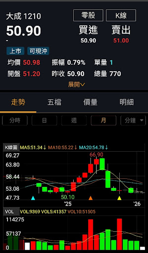
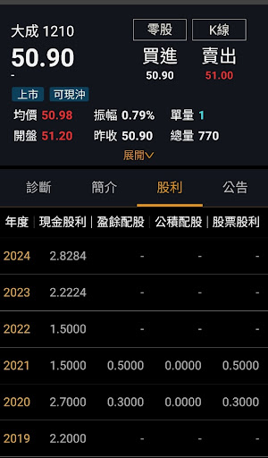
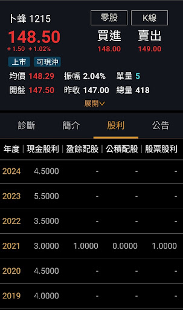
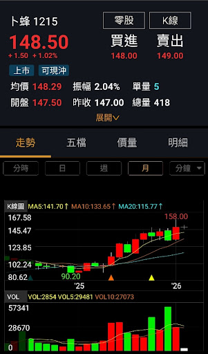

# 股票股息殖利率估價分析

**Date**: February 20, 2026 at 12:05 AM
**Turns**: 2
**Source**: [Gemini Chat](https://gemini.google.com/app/c2506d04d26ff39d)

---

## Turn 1

### 👤 User

*[This turn includes uploaded images]*

這是一支食品類公司股票，我已長期持有，若以其股息分配，來推算，要用何種分析工具其走勢圖，及何種推算法，估其適合的股價進場?何價位釋出調整?

### 🤖 Assistant

依照您設定的專家優化流程，我將首先進行提示詞的轉化與優化，隨後根據優化後的指令進行專業分析與答覆。

---

### 第一步：專家優化
**原始提示詞：**
這是一支食品類公司股票（大成 1210），我已長期持有，若以其股息分配，來推算，要用何種分析工具其走勢圖，及何種推算法，估其適合的股價進場?何價位釋出調整?
**優化後提示詞：**

- **[角色任務]**：
你是一位專精於台股價值投資與技術分析的財務顧問，擅長結合「股息貼現模型」與「長線技術指標」來制定操作策略。
- **[背景資訊]**：
使用者長期持有大成（1210），目標是利用「歷年股利發放紀錄」來推算合理估值區間。目前股價約 50.9 元，月線圖顯示股價從高點 66.9 元回落整理中。近五年股利包含現金與股票，且呈現成長趨勢（2024 年現金股利達 2.8 元）。
- **[具體指令]**：
  1. **股價估值計算**：請運用「平均股利殖利率法」計算出「便宜（進場）」、「合理（持有）」與「昂貴（調節）」的三個具體價位。
  2. **技術分析工具**：針對使用者提供的「月 K 線圖」，推薦適合判斷長線買賣點的技術指標（如均線、KD），並解讀目前的位階。
  3. **操作建議**：綜合基本面與技術面，給出具體的進出場策略與觀察重點。
- **[約束條件]**：
字數精簡、邏輯清晰、提供具體算式、語氣專業且鼓勵人心。

---

### 第二步：直接答覆
**日期時間：** 2026/02/09
針對您持有的大成（1210），這是一支典型的食品龍頭股，具有抗通膨與獲利穩定的特性。以下結合您提供的截圖數據，為您規劃進出場的分析邏輯：

#### 1. 估價推算法：平均股利殖利率法
對於長期持有的存股族，「殖利率」是最直觀且有效的估價工具。我們採用**「近 5 年平均股利」**來平滑單一年度的波動。

| 評價位階 | 計算邏輯 (殖利率要求) | 參考股價 (算式) | 操作策略 |
| --- | --- | --- | --- |
| 便宜價 | 要求 6% 以上殖利率 | 2.31÷6%=38.5 元 | 強力買進 (安全邊際高) |
| 合理價 | 要求 4.5% - 5% 殖利率 | 2.31÷5%=46.2 元 | 分批佈局 / 續抱 |
| 昂貴價 | 殖利率低於 3.5% | 2.31÷3.5%=66.0 元 | 分批賣出 / 減碼 |

#### 2. 走勢圖分析工具：月線格局
您提供的是「月 K 線圖」，這是判斷長線大趨勢的最佳週期。建議您疊加以下兩個工具來輔助判斷：

1. **長天期均線 (MA)：判斷成本與支撐**
  - **觀察重點**：看 **20 月均線（月線圖中的 MA20，又稱月季線/趨勢線）** 與 **60 月均線（五年線）**。
  - **解讀**：圖中顯示 MA5 (51.34) 已跌破 MA10，股價目前在測試 MA20 (54.78) 下方的支撐力道。若股價能守穩在 46-48 元（約 60 月均線或是前波整理平台），就是很好的長線支撐點。
2. **月 KD 指標 (Stochastic Oscillator)：判斷位階**
  - **進場訊號**：當月 K 值 < 20 且由下往上交叉 D 值時，通常是長線的大買點（大成過去幾次低點都符合此特徵）。
  - **出場訊號**：當月 K 值 > 80 且由上往下交叉 D 值時（如圖中股價 66.9 元那波），顯示過熱，應考慮調節。

#### 3. 綜合操作建議 (Next Steps)
基於您「長期持有」的身分，建議採取以下策略：

- **進場 (加碼) 點**：
  - **價格策略**：若股價回落至 **46 元**（合理價下緣）以下，開始分批承接；若見到 **40 元** 以下則積極買進。
  - **技術策略**：等待月 K 線收紅，且站回 52 元之上，確認止跌回升再加碼。
- **釋出 (調節) 點**：
  - **價格策略**：接近 **60 元** 以上（殖利率低於 4%）時，可開始分批獲利了結。
  - **訊號**：若月營收出現連續 3 個月年減，或原物料（黃豆/玉米）價格異常飆漲侵蝕毛利時，即使價格未到也可先減碼。
**小結**：目前 50.9 元價格適中，領息沒問題，但若要加碼擴大部位，建議耐心等待股價回測 **46 元** 附近的支撐會更安全。

## Turn 2

### 👤 User

*[This turn includes uploaded images]*

這是類似的股票，卜蜂

### 🤖 Assistant

依照您的指示，我將再次執行「專家優化」流程，針對 **卜蜂（1215）** 這支性質略有不同的食品股進行分析。

---

### 第一步：專家優化
**原始提示詞：**
這是類似的股票，卜蜂（1215）。（除了前述的估價外，請比較其與大成的差異）
**優化後提示詞：**

- **[角色任務]**：
你是一名資深台股分析師，專長於傳產股的「成長性」與「防禦性」分析。
- **[背景資訊]**：
使用者持有或關注卜蜂（1215），目前股價 148.5 元，處於歷史高檔區。月線圖呈現強勢多頭排列（MA5 > MA10 > MA20）。股利政策近兩年顯著提升（2023 現金 5.5 元、2024 現金 4.5 元），顯示其獲利能力優於同業。
- **[具體指令]**：
  1. **估價邏輯調整**：由於卜蜂近年獲利爆發，市場給予較高評價，請使用「近 3 年加權平均股利」來計算更貼近現況的估值，並指出其與大成（1210）在投資屬性上的本質差異。
  2. **技術面解讀**：解讀月線圖的「多頭排列」訊號，以及歷史高點 158 元的壓力測試。
  3. **操作策略**：針對「高檔強勢股」給予不同於低檔存股的進出建議。
- **[約束條件]**：
需明確對比兩支股票的優劣勢，提供具體支撐價位，語氣客觀且具風險意識。

---

### 第二步：直接答覆
**日期時間：** 2026/02/09
針對 **卜蜂（1215）**，雖然它與大成同屬飼料與食品加工業，但在資本市場的評價邏輯截然不同。如果說大成是「穩健領息股」，卜蜂目前更像是「成長型食品股」。
以下是針對卜蜂的詳細分析：

#### 1. 估價推算法：成長溢價模式
不同於大成股價相對平穩，卜蜂近年獲利大幅成長，市場願意給予較高的股價（較低的殖利率）。若用 5 年平均會嚴重低估它，因此我們改採**「近 3 年平均現金股利」**來推算，較符合目前的獲利位階。

| 評價位階 | 計算邏輯 (殖利率要求) | 參考股價 (算式) | 狀態解讀 |
| --- | --- | --- | --- |
| 便宜價 | 要求 5% 殖利率 | 4.5÷5%=90 元 | (目前難見，除非大崩盤) |
| 合理價 | 要求 4% 殖利率 | 4.5÷4%=112.5 元 | (長線支撐區) |
| 昂貴價 | 殖利率低於 3% | 4.5÷3%=150 元 | 目前股價在此附近 |

#### 2. 走勢圖分析工具：強勢多頭格局
您提供的月 K 線圖顯示出教科書等級的強勢訊號，與大成的回檔整理完全不同：

1. **均線多頭排列 (最強化趨勢)**
  - **現象**：MA5 (141.7) > MA10 (133.6) > MA20 (115.7)，三條均線向上發散。
  - **解讀**：這代表短、中、長期持有的人都賺錢，籌碼極度穩定，上方無太多套牢賣壓（除了 158 元高點那根避雷針）。
2. **支撐觀察**
  - **強勢支撐**：**MA5 (約 141 元)**。只要月線收盤不跌破這條線，強勢攻擊格局就不變。
  - **生命線支撐**：**MA10 (約 133 元)**。若跌破 MA5，下一道防線看這裡，通常是波段回檔的最佳買點。

#### 3. 大成 (1210) vs. 卜蜂 (1215) 比較與選擇
這兩支股票雖然業務相似，但操作邏輯完全不同：

| 比較項目 | 大成 (1210) | 卜蜂 (1215) |
| --- | --- | --- |
| 目前型態 | 回檔整理 (低基期) | 創高強勢 (高基期) |
| 適合對象 | 喜歡撿便宜、重視高殖利率、個性保守者 | 喜歡賺價差、能承受波動、追求資金效率者 |
| 股性 | 溫吞、牛皮 | 活潑、漲跌速度快 |
| 主要風險 | 股價盤整太久，時間成本高 | 追高後若獲利衰退，修正幅度會很大 |

#### 4. 綜合操作建議 (Next Steps)
針對卜蜂，您的操作策略應調整為「順勢操作」而非「低接存股」：

- **若您尚未持有**：
  - **不建議**現在 148.5 元直接重壓，因為肉（股息）少骨頭（價格）硬。
  - **建議等待**：耐心等候股價回測 **MA10 (約 133-135 元)** 附近，且量縮止穩時再進場，勝率較高。
- **若您已持有**：
  - **續抱條件**：只要月 K 線收盤價沒有跌破 **140 元**，都建議續抱，讓利潤奔跑。
  - **停利訊號**：若股價再次挑戰 **158 元** 失敗（爆大量收黑K），或殖利率低於 2.8%（股價約 160 元），建議先調節獲利一趟。
**一句話總結**：大成適合「存」，卜蜂適合「波段操作」。目前卜蜂價格偏貴，進場需更有耐心等待回檔。

---

*Exported from [Gemini Voyager](https://github.com/Nagi-ovo/gemini-voyager)*  
*Generated on February 20, 2026 at 12:05 AM*