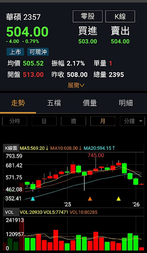
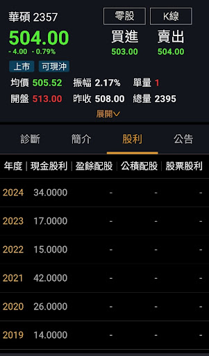

# 華碩股價分析與操作建議

**Date**: February 20, 2026 at 12:04 AM
**Turns**: 1
**Source**: [Gemini Chat](https://gemini.google.com/app/0d53bf62b4e4320c)

---

## Turn 1

### 👤 User

*[This turn includes uploaded images]*

這是一支電子公司股票，我已長期持有，若以其股息分配，來推算，要用何種分析工具其走勢圖，及何種推算法，估其適合的股價進場?何價位釋出調整?

### 🤖 Assistant

依照您的要求，在開始分析之前，先執行**專家優化**步驟，將您的需求轉化為精確的分析指令。

### 第一步：專家優化
**原始提示詞轉化為高效能指令：**

- **[角色任務]**：資深台股價值投資顧問與技術分析師（專精於電子循環股與長線佈局）。
- **[背景資訊]**：使用者長期持有華碩（2357），目前股價回檔至 504 元。使用者希望利用「歷年股息數據」作為估值核心，並搭配「技術線圖」尋找具體的進出場價位。
- **[具體指令]**：
  1. **選用工具**：定義適合循環股的「殖利率區間法（河流圖）」與「月 K 線長期支撐」。
  2. **估價推算**：基於提供的股利截圖，計算「平均股利」，並推導出「便宜、合理、昂貴」三種價位。
  3. **走勢判讀**：分析月線圖目前的修正位置與支撐區。
  4. **操作建議**：綜合基本面與技術面，給出具體的加減碼策略。
- **[約束條件]**：語氣專業且客觀，使用 LaTeX 呈現算式，標示重要價格區間，結論需包含風險提示。

---

### 第二步：直接答覆
基於上述優化後的指令，針對您持有的 **華碩（2357）** 進行詳細分析：

#### 一、 分析工具選擇：殖利率區間法 ＋ 月 K 線趨勢
由於華碩屬於 **「成熟型電子品牌廠」**，其獲利與股價具有明顯的 **「循環性」**（受 PC/NB 景氣影響大），且您是長期持有者，最適合的分析組合為：

1. **估價工具：殖利率區間法（Yield Valuations）**
  - 華碩配息不穩定（從 14 元到 42 元都有），不能只看單一年度。必須使用 **「近 3~5 年平均股利」** 來抓出股價的「地板」與「天花板」。
2. **走勢工具：月 K 線（Long-term Trend）**
  - 您提供的截圖是「月 K 線」，這是正確的選擇。長期投資人應忽略日線波動，專注於月線的長期趨勢與大支撐。

#### 二、 價格推算法：股價位階計算
根據您提供的股利截圖，華碩的配息波動較大，我們採取 **「5 年平均股利法」** 來平滑景氣波動，這樣算出的價格才安全。
**1. 計算平均股利**
參考您提供的圖表數據（2019-2023/24）：

$$
\text{近5年股利} = 34 + 17 + 15 + 42 + 26 = 134
$$

$$
\text{平均股利} = \frac{134}{5} \approx 26.8 \text{ 元}
$$
*(註：若樂觀一點，預期 AI PC 換機潮帶動，可將預期股利稍微上調至 28-30 元，但保守估計我們先用 26.8 元)*
**2. 設定殖利率區間（進出場標準）**
電子股通常要求較高的風險溢酬：

- **便宜價（適合進場/加碼）**：殖利率 > **6%**
- **合理價（持有/觀望）**：殖利率約 **5%**
- **昂貴價（適合釋出/減碼）**：殖利率 < **3.5% ~ 4%**
**3. 推算目標價位**
利用公式：

$$
\text{股價} = \frac{\text{股利}}{\text{殖利率}}
$$

- **🟢 便宜價（進場區）**：
$\frac{26.8}{0.06} \approx 446 \text{ 元}$*(若以較高的 2024 配息 34 元計算，7% 殖利率約在 485 元)*
- **🟡 合理價（中位數）**：
$\frac{26.8}{0.05} \approx 536 \text{ 元}$
- **🔴 昂貴價（釋出區）**：
$\frac{26.8}{0.035} \approx 765 \text{ 元}$

#### 三、 技術面走勢判讀（月 K 線圖）
觀察您提供的第一張月線圖：

1. **目前型態**：股價從高點 **745** 元回落，目前在 **504** 元。這是一個明顯的中期修正波段。
2. **均線排列**：
  - 圖中顯示 MA5（569）已經下彎，且股價位於 MA5、MA10、MA20 之下，代表目前處於 **「空頭修正」** 階段，落底訊號尚未出現。
3. **支撐觀察**：
  - **大量區支撐**：觀察 2021-2022 年的整理平台，以及圖左側的起漲點，主要強力支撐區約落在 **420元 ~ 460元** 之間。
  - **整數關卡**：**500元** 大關是心理支撐，目前正在測試此處。

#### 四、 綜合操作建議
針對您「長期持有」且希望「以息推價」的需求，建議策略如下：

- **進場/加碼時機**：
  - **價格區間**：建議在 **450元 ~ 480元** 之間開始分批佈局。此區間對應殖利率約 5.5%~6%，且接近技術面的長期支撐區。
  - **觀察訊號**：月 K 線出現「下影線」或「實體紅棒」止跌，且成交量縮小時，才是安全的進場點。目前 504 元仍有下探風險，不需急著一次接滿。
- **釋出/調整時機**：
  - **價格區間**：若股價反彈至 **670元 ~ 750元**（對應殖利率低於 4%），或接近前波高點 745 元時，是適當的獲利了結或減碼點。
  - **邏輯**：當殖利率低於 4% 時，持有電子股的領息優勢已不如債券或定存，風險報酬比不佳。
**總結下一步**：
目前股價 504 元處於「合理偏低」的位置，但技術面尚未止穩。建議您設下 **480 元** 的價格提醒，屆時再觀察是否進場加碼。

---

*Exported from [Gemini Voyager](https://github.com/Nagi-ovo/gemini-voyager)*  
*Generated on February 20, 2026 at 12:04 AM*