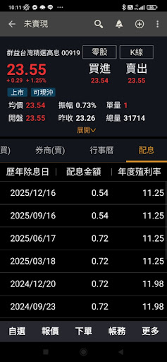
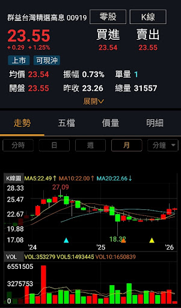

# 高股息ETF 00919 投資策略

**Date**: February 20, 2026 at 12:05 AM
**Turns**: 1
**Source**: [Gemini Chat](https://gemini.google.com/app/71961bb80a265550)

---

## Turn 1

### 👤 User

*[This turn includes uploaded images]*

這是一支ETF，若以其股息分配，來推算，要用何種分析工具其走勢圖，及何種推算法，估其適合的股價進場?何價位釋出調整?

### 🤖 Assistant

這是一個關於高股息 ETF（00919 群益台灣精選高息）的進階操作問題。根據您的截圖（顯示時間為 2026 年 2 月，股價 23.55 元），這是一檔典型的「配息型」商品。
針對這類高股息 ETF，不建議單純使用一般的技術分析（如只看 KD 或 MACD），因為其股價受「配息金額」影響最大。以下為您整理最適合的**分析工具**、**推算法**以及**進出場策略**：

### 一、 核心分析工具：殖利率區間法 (Yield Band Analysis)
對於 00919 這類主打「高息」的 ETF，股價的漲跌通常由「預期殖利率」決定。市場會給予它一個合理的殖利率區間（例如 8%~10%），當股價偏離這個區間時，就是進出的訊號。

#### 1. 估算「年化配息金額」
這是計算的基礎。從您的截圖 1 可以看到一個關鍵警訊：

- **過去配息：** 2025 年上半年皆為 **0.72** 元。
- **近期配息：** 2025 年 9 月與 12 月降為 **0.54** 元。
- **推算邏輯：** 為了安全起見，建議採「保守估算」，假設未來四季都維持 **0.54** 元。
  - **預估年配息 = 0.54 × 4 = 2.16 元**

#### 2. 設定「便宜/合理/昂貴」價位
根據高股息 ETF 的市場特性，通常投資人要求的殖利率底線約為 7%~8%，而當殖利率超過 10% 時會被視為極度便宜。

- **便宜價（進場區，殖利率 10%）：**$2.16 \div 10\% = \mathbf{21.6 \text{ 元}}$
- **合理價（持有區，殖利率 8%）：**$2.16 \div 8\% = \mathbf{27.0 \text{ 元}}$
- **昂貴價（調節區，殖利率 7% 以下）：**$2.16 \div 7\% = \mathbf{30.8 \text{ 元}}$
分析結論： 目前股價 23.55 元，介於便宜價 (21.6) 與合理價 (27.0) 之間，屬於「合理偏低」的區間，但尚未到達「閉著眼睛買」的甜蜜點。
---

### 二、 輔助分析工具：月線技術趨勢 (Monthly Trend)
您的截圖 2 是「月 K 線圖」，這是正確的，因為領息族應看長期趨勢。

- **觀察指標：生命線 (MA20 / 月線圖中的 20MA)**
  - 截圖顯示 **MA20 (綠線)** 的數值為 **22.66**。
  - 目前股價 **23.55** 仍在 MA20 之上，代表長多格局尚未破壞。
  - **支撐判斷：** 22.66 是一個強力的技術支撐位。如果股價回測此處不破，是良好的加碼點。

---

### 三、 綜合進出場策略 (SOP)
結合上述的「殖利率估價」與「技術支撐」，建議的操作策略如下：

#### 1. 進場策略 (Buy Strategy)
採用**分批佈局**，不要一次梭哈，因為配息從 0.72 降至 0.54 代表基本面轉弱。

- **第一買點（技術面）：** 當股價回測 **月線 MA20 (約 22.6~22.7 元)** 且未跌破時，可建立基本持股。
- **強力買點（估值面）：** 若市場恐慌，導致股價跌至 **21.6 元以下**（換算殖利率 > 10%），這時是安全邊際極高的進場點。

#### 2. 釋出調整策略 (Sell/Adjust Strategy)
高股息 ETF 通常是「領息為主」，但以下兩種情況建議減碼或獲利了結：

- **情況 A（漲太多）：** 股價上漲導致殖利率低於 7%。以目前配息水準推算，若股價漲過 **30.8 元**，建議分批賣出，賺取價差優於領息。
- **情況 B（配息續降）：****這是最大風險。** 請密切觀察 2026 年 3 月的配息公告。如果配息金額從 0.54 進一步下降（例如跌破 0.5），則上述的「便宜價」會變得更低（例如配息變 0.4，便宜價就變成 16 元），此時應考慮停損或換股。

### 總結

- **使用工具：** 預估殖利率（基本面） + 月 K 線 MA20（技術面）。
- **目前狀態：** 股價 23.55 元，處於「合理區間」。
- **關鍵操作：** 等待股價回測 **22.66 (MA20)** 附近再考慮佈局，並密切監控下一次配息是否能維持在 0.54 元以上。
*(免責聲明：以上分析僅基於您提供的截圖數據與數學模型推算，不代表投資建議。投資前請審慎評估風險。)*

---

*Exported from [Gemini Voyager](https://github.com/Nagi-ovo/gemini-voyager)*  
*Generated on February 20, 2026 at 12:05 AM*